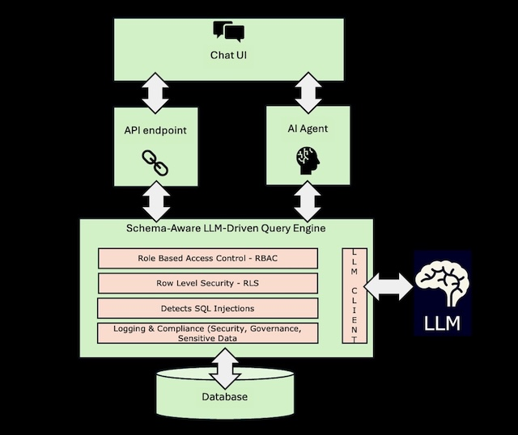

# 🧠 Schema-Aware AI SQL Agent

Translate natural language into **secure, production-ready SQL** — built for real-world enterprise use.

Built with **LangChain**, **FastAPI**, and **Streamlit**, with guardrails for schema validation, role-based access control (RBAC), row-level security (RLS), and query sanitization.

---

## 🔍 What It Does

The **Schema-Aware AI SQL Agent** bridges the gap between LLMs and production databases — turning plain English into SQL safely, with full guardrails in place.

Built entirely in Python with open-source tools, it's designed for environments where **security, compliance, and accuracy matter**.

---

## ✨ Key Features

| Feature | Description |
|---|---|
| 💬 Natural language to SQL | Powered by your choice of LLM (OpenAI, OpenRouter, Ollama) |
| 🔐 RBAC & RLS | Role-based access control and row-level security enforced on every query |
| ✅ Schema-aware validation | Generated SQL is checked against your real schema and sanitized before execution |
| 🧠 Memory-aware agent | Stateful chat mode with multi-turn context and clarification flow |
| ⚙️ REST API + UI | FastAPI backend with a Streamlit chat front-end |
| 🧪 Sample database | Includes a ready-to-use PostgreSQL Northwind dataset for testing |

---

## 🧩 Architecture

A high-level view from UI → LLM → SQL execution:



---

## 🚀 Quickstart

```bash
git clone https://github.com/Skaayth/schema-aware-ai-sql-agent.git
cd schema-aware-ai-sql-agent
python -m venv venv
source venv/bin/activate
pip install -r requirements.txt
cp .env.example .env  # then edit with your values
```

**Start the backend:**

```bash
uvicorn backend.api.api:app --host 127.0.0.1 --port 8000 --reload
```

**Start the frontend UI:**

```bash
python3 -m streamlit run frontend/chat_UI.py
```

Then open [http://localhost:8501](http://localhost:8501) to start chatting with your database.

---

## 📖 Full Documentation

For detailed setup (including Docker), configuration, RBAC/RLS rules, and architecture details, see [README_FULL.md](README_FULL.md).

---

## 🛡️ Security

Found a vulnerability? See [security.md](security.md) for how to report it responsibly.

---

## 👤 Author

**Saketh Reddy Pannala**

---

## 📄 License

Licensed under the [MIT License](LICENSE) — use it, modify it, build on it.
